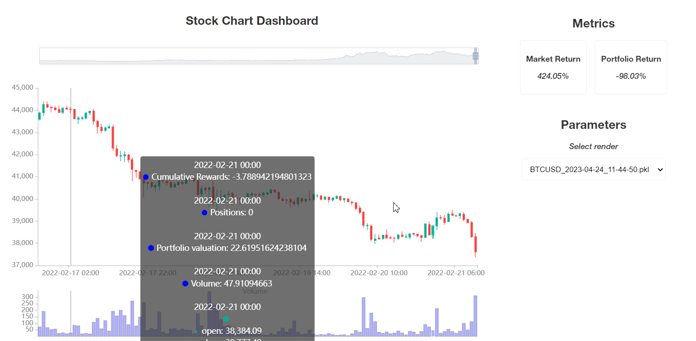

Environment Quick Summary
=========================

  
  
This environment is a `Gymnasium <https://gymnasium.farama.org/content/basic_usage/>`_ environment designed for trading on a single pair.

.. list-table::
   :widths: 25 70
   :header-rows: 0
   
   * - Action Space
     - ``Discrete(number_of_positions)``
   * - Observation Space
     - ``Box(-np.inf, +np.inf, shape=...)``
   * - Import
     - ``gymnasium.make("TradingEnv", df=df)``

Important Parameters
--------------------

* ``df`` *(required)*: A pandas.DataFrame with a ``close`` and DatetimeIndex as index. To perform a render, your DataFrame also needs to contain ``open``, ``low``, and ``high``. 
* ``positions`` *(optional, default: [-1, 0, 1])*: The list of positions that your agent can take. Each position is represented by a number (as described in the *Action Space* section).

`Documentation of all the parameters <https://gym-trading-env.readthedocs.io/en/latest/documentation.html#gym_trading_env.environments.TradingEnv>`_

Action Space
------------

The action space is a list of **positions** given by the user. Every position is labeled from -inf to +inf and corresponds to the ratio of the portfolio valuation engaged in the position ( > 0 to bet on the rise, < 0 to bet on the decrease).

.. list-table:: Example with BTC/USDT pair (%pv means *"Percent of the Portfolio Valuation"*)
   :widths: 5 5 5 5 5
   :header-rows: 1
   
   * - Position examples
     - BTC (%pv)
     - USDT (%pv)
     - Borrowed BTC (%pv)
     - Borrowed USDT (%pv)
   * - **0**
     -  
     - 100
     -  
     -  
   * - **1**
     - 100
     -  
     -  
     -  
   * - **0.5**
     - 50
     - 50
     - 
     - 
   * - **2**
     - 200
     -  
     -  
     - 100
   * - **-1**
     -  
     - 200
     - 100
     -  
     

If ``position < 0``: the environment performs a SHORT (by borrowing USDT and buying BTC with it).

If ``position > 1``: the environment uses MARGIN trading (by borrowing BTC and selling it to get USDT).

Observation Space
------------------

The observation space is an np.array containing:

* The row of your DataFrame columns containing ``features`` in their name, at a given step : the **static features**
* The **dynamic features** (by default, the last position taken by the agent, and the current real position).

.. code-block:: python

  >>> df["feature_pct_change"] = df["close"].pct_change()
  >>> df["feature_high"] = df["high"] / df["close"] - 1
  >>> df["feature_low"] = df["low"] / df["close"] - 1
  >>> df.dropna(inplace= True)
  >>> env = gymnasium.make("TradingEnv", df = df, positions = [-1, 0, 1], initial_position= 1)
  >>> observation, info = env.reset()
  >>> observation
  array([-2.2766300e-04,  1.0030895e+00,  9.9795288e-01,  1.0000000e+00], dtype=float32)

If the ``windows`` parameter is set to an integer W > 1, the observation is a stack of the last W states.

.. code-block:: python
  
  >>> env = gymnasium.make("TradingEnv", df = df, positions = [-1, 0, 1], initial_position= 1, windows = 3)
  >>> observation, info = env.reset()
  >>> observation
  array([[-0.00231082,  1.0052915 ,  0.9991996 ,  1.        ],
         [ 0.01005705,  1.0078559 ,  0.98854125,  1.        ],
         [-0.00408145,  1.0069852 ,  0.99777853,  1.        ]],
         dtype=float32)

Reward
----------

The reward is given by the formula :math:`r_{t} = ln(\frac{p_{t}}{p_{t-1}})\text{ with }p_{t}\text{ = portofolio valuation at timestep }t` . It is highly recommended to `customize the reward function <https://gym-trading-env.readthedocs.io/en/latest/customization.html#custom-reward-function>`_ to your needs.

Starting State
---------------

The environment explores the given DataFrame and starts at its beginning.

Episode Termination
--------------------

The episode finishes if:

1 - The environment reaches the end of the DataFrame, ``truncated`` is returned as ``True``
2 - The portfolio valuation reaches 0 (or bellow). ``done`` is returned as ``True``. It can happen when taking margin positions (>1 or <0).

Arguments
------------

.. autoclass:: gym_trading_env.environments.TradingEnv
