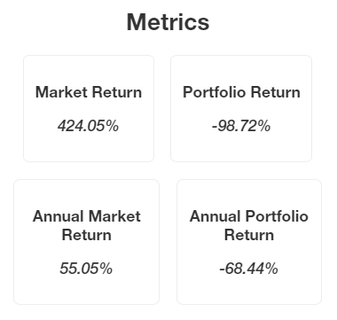

Render
======

.. note::

  The render runs with ``Flask`` on localhost as a web app, and the charts are drawn with the ``pyecharts`` librairy.

Your first render
-----------------

For the render not to perturb the training, it needs to be performed in a separate python script. This way you can explore your episode results without disturbing your RL-agent training.

In the *running environment script*, you need to save your render logs :

.. code-block:: python

  # At the end of the episode you want to render
  env.save_for_render(dir = "render_logs")

Then, in a *separate script* :

.. code-block:: python

  from gym_trading_env.renderer import Renderer
  renderer = Renderer(render_logs_dir="render_logs")
  renderer.run()

.. code-block:: bash

  ...
  * Running on http://127.0.0.1:5000
  ...

Go to URL mentionned by Flask (here `http://127.0.0.1:5000 <http://127.0.0.1:5000>`_)
 
.. image:: images/render.gif
  :alt: Alternative text

Customize your render
---------------------

Add custom lines
^^^^^^^^^^^^^^^^

.. code-block:: python
  
  renderer = Renderer(render_logs_dir="render_logs")
  
  # Add Custom Lines (Simple Moving Average)
  renderer.add_line( name= "sma10", function= lambda df : df["close"].rolling(10).mean(), line_options ={"width" : 1, "color": "purple"})
  renderer.add_line( name= "sma20", function= lambda df : df["close"].rolling(20).mean(), line_options ={"width" : 1, "color": "blue"})
  
  renderer.run()

.. image:: images/custom_lines.PNG
  :width: 600
  :alt: Alternative text

Add custom lines with ``.add_line(name, function, line_options)`` that takes following parameters :

* ``name`` : The name of the line.
* ``function`` : The function takes the `History object <https://gym-trading-env.readthedocs.io/en/latest/history.html>`_ (converted into a DataFrame because performance does not really matter anymore during renders) of the episode as a parameter and needs to return a Series, 1-D array, or list of the length of the DataFrame.
* ``line_options`` *(optional)* : A Dict object that can have keys ``color`` (str) and ``width`` (int) to control the appearance of the plot.

Add custom metrics
^^^^^^^^^^^^^^^^^^

.. code-block:: python
  
  renderer = Renderer(render_logs_dir="render_logs")

  # Add Custom Metrics (Annualized metrics)
  renderer.add_metric(
      name = "Annual Market Return",
      function = lambda df : f"{ ((df['close'].iloc[-1] / df['close'].iloc[0])**(pd.Timedelta(days=365)/(df.index.values[-1] - df.index.values[0]))-1)*100:0.2f}%"
  )
  renderer.add_metric(
          name = "Annual Portfolio Return",
          function = lambda df : f"{((df['portfolio_valuation'].iloc[-1] / df['portfolio_valuation'].iloc[0])**(pd.Timedelta(days=365)/(df.index.values[-1] - df.index.values[0]))-1)*100:0.2f}%"
  )

  renderer.run()

Add custom metrics with ``.add_metric(name, function)`` that takes following parameters :

* ``name`` : The name of the metrics.
* ``function`` : The function takes the History object (converted into a DataFrame) of the episode as a parameter and needs to return a string.
